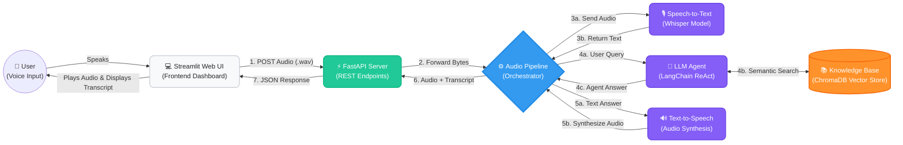

# Audio Customer Support Agent Architecture

This document provides a high-level overview of the system architecture for the Audio Customer Support Agent, illustrating how the individual components interact to process audio queries and return intelligent, voice-synthesized responses.

## System Flow Diagram

The following diagram illustrates the complete end-to-end request lifecycle:

---

## Component Breakdown

### 1. Client Interface (`streamlit_app.py`)
- **Role:** Provides a user-friendly web dashboard for testing.
- **Functionality:** Allows users to record from their microphone or upload audio files. It sends HTTP requests to the backend API, parses the resulting JSON payload, decodes the Base64 audio for playback, and displays the transcript and processing metrics side-by-side.

### 2. FastAPI Server (`src/api/server.py`)
- **Role:** The HTTP routing and entry point for the backend.
- **Functionality:** Exposes RESTful endpoints (`/chat/audio`, `/chat/text`, `/health`). It handles incoming file uploads, validates requests, invokes the orchestration pipeline, and structures the final output using Pydantic models (e.g., `EnhancedAudioResponse`).

### 3. Orchestration Pipeline (`src/pipeline.py`)
- **Role:** The central coordinator.
- **Functionality:** Manages the sequential asynchronous execution of the three core AI components (STT → LLM → TTS). It handles errors centrally, measures processing time, and constructs the structured transcript data linking the user's initial query to the agent's final response.

### 4. Speech-to-Text (STT) (`src/stt/base_stt.py`)
- **Role:** Transcribes spoken audio into text.
- **Functionality:** Utilizes a local Whisper model to accurately convert user-uploaded WAV/MP3 files into standard text strings that the LLM can understand.

### 5. LLM Agent & RAG (`src/llm/agent.py`)
- **Role:** The "brain" of the customer support agent.
- **Functionality:** Built using the LangChain framework utilizing a ReAct (Reasoning and Acting) prompt structure. 
  - **RAG (Retrieval-Augmented Generation):** It integrates with **ChromaDB**, a vector database containing predefined customer support documents. When a question is asked, the agent performs a semantic search against the database to fetch accurate context (like return policies or shipping times) before formulating its answer.

### 6. Text-to-Speech (TTS) (`src/tts/base_tts.py`)
- **Role:** Converts the agent's text response back into spoken audio.
- **Functionality:** Takes the final string generated by the LLM and synthesizes it into an MP3 byte stream, ready to be sent back to the user.
